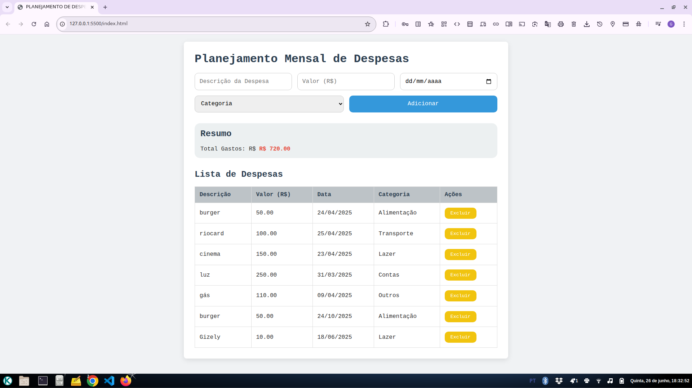
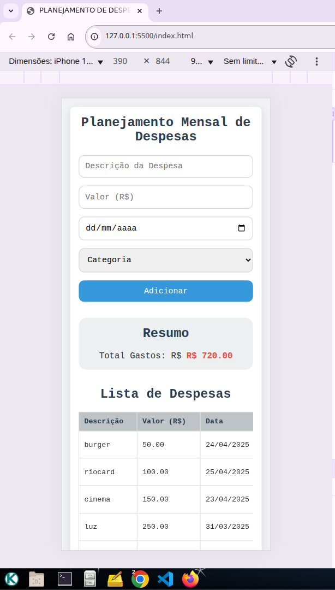

## 🚀 Planejamento Mensal de Gastos

Olá! Esse é o seu companheiro de bolso para organizar **todas** as suas despesas do mês.

### 💡 O que é?
É uma aplicação web leve em HTML, CSS e JavaScript que te ajuda a:

- Adicionar e listar despesas
- Filtrar por data e categoria
- Visualizar o total gasto em tempo real
- Funciona lindamente em qualquer tela (desktop, tablet e celular)

### ✨ Funcionalidades

- **Formulário intuitivo** para cadastrar descrição, valor, data e categoria
- **Resumo dinâmico**: total de gastos exibido em tempo real
- **Lista de despesas** com opções de edição e remoção (adicionar depois se quiser!)
- **Layout responsivo**, pra ninguém passar raiva no celular
- **Salvar** automaticamente seus dados no LocalStorage, garantindo que nada se perca




### 🛠️ Tecnologias

- **HTML5**
- **CSS3**
- **JavaScript puro**

### 📱 Responsividade
O projeto já vem preparado para ficar lindo em:

- **Celular:** formulário empilhado e tabela rolável
- **Tablet/Desktop:** layout em colunas

### 🔧 Como usar localmente

1. Clone este repositório:
   ```bash
   git clone https://github.com/seu-usuario/planejamento-gastos.git
   ```
2. Entre na pasta do projeto:
   ```bash
   cd planejamento-gastos
   ```
3. Abra o `index.html` no seu navegador favorito.

E a mágica acontece 🙌